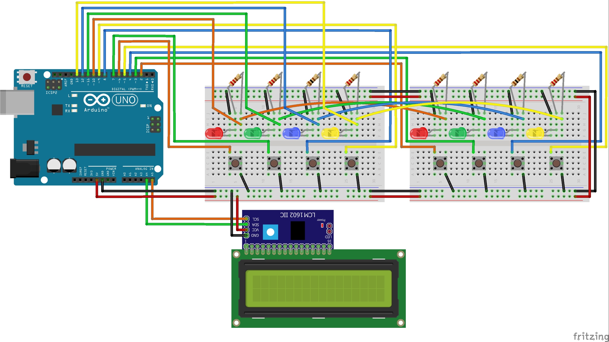

# LFn-t
An Arduino project for Embeded Systems course

## Parts and schematic

|        **Part**       | **Quantity** |
|:---------------------:|:------------:|
|    Arduino Uno Rev3   |       1      |
|        LCD 16x2       |       1      |
| Converter I2C for LCD |       1      |
|        Red LED        |       2      |
|       Green LED       |       2      |
|        Blue LED       |       2      |
|       Yellow LED      |       2      |
|    Resistor 220 Ohm   |       6      |
|    Resistor 100 Ohm   |       2      |
|   Tact Switch 2 PIN   |       8      |
|    Half BreadBoard    |       2      |
|         Cables        |     A lot    |

## Video presenting this in action
[](https://www.youtube.com/watch?v=BdKcJv0rTCg)

## Environment
Developed in Arduino IDE with use of [LiquidCrystal_I2C](https://www.arduinolibraries.info/libraries/liquid-crystal-i2-c) library.

## Difficulties
|                                 **Difficulty**                                 |                          **Solution**                         |                                                                    **Conclusion**                                                                   |
|:------------------------------------------------------------------------------:|:-------------------------------------------------------------:|:---------------------------------------------------------------------------------------------------------------------------------------------------:|
|     Fitting all of the parts on one half-BreadBoard due to having only one.    |              Designing space efficient schematic.             |                                             Solution didn't work and had to get a second half-BreadBoard                                            |
| Fitting all 16 signals (2x 4 LEDs, 2x 4 Buttons) on 12 available Arduino pins. | LEDs can be connected in pairs so there are 12 total signals. | Solution worked, but both players get the same button to press and connecting LEDs was tricky (they had to be in parallel, each with own resistor). |
|             Held down button being read multiple times in program.             |       Wait for button to be released before continuing.       |                                   Side effect is that the program will not progress until the button is released.                                   |
|                    Getting seed for random number generator.                   |        Use value of disconnected analog port (here A0).       |                                    Reading disconnected analog port gives noise values which can be used as seed.                                   |

## Interesting code snippets

### Macro for easy getting the state of a button
```c++
#define isPressed(x) (digitalRead(x)==LOW)
```

### Waiting for either of the 2 buttons (`buttonP1` or `buttonP2`) to be pressed and saving their state
```c++
while ( (valP1 = digitalRead(buttonP1)) == HIGH && (valP2 = digitalRead(buttonP2)) == HIGH ) {}
```

### Printing number to LCD centered
```c++
char buf[4];
itoa(roundsNumber, buf, 10);
int pos = 8 - (strlen(buf) / 2);
lcd.setCursor(pos, 1);
lcd.printstr(buf);
```

### Waiting for the button to be let go of so there won't be a misinput on the next "*frame*"
```c++
while (isPressed(P1_BLUE) || isPressed(P2_BLUE)) {}
```

## Authors
* Szymon Kaczmarek 148056
* Adam Jurcz 144441
